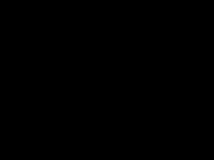

# Basic Wave Simulator

Example of a Gaussian beam:

Example of an obstacle with Dirichlet boundary conditions:

Currently in a Schwarzschild black hole run configuration, but changing the arrays massDensity, txx, tyy, txy can lead to simulating other things (optics, water waves with wave speed sqrt(gh), any static spacetime). 
